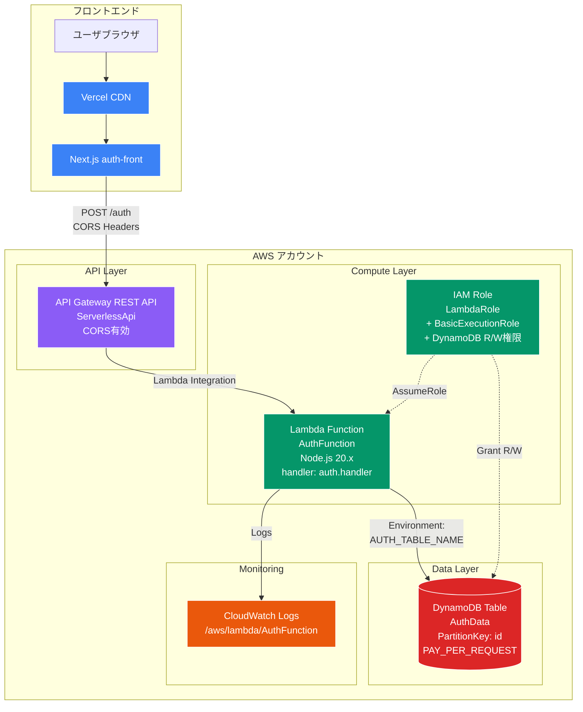
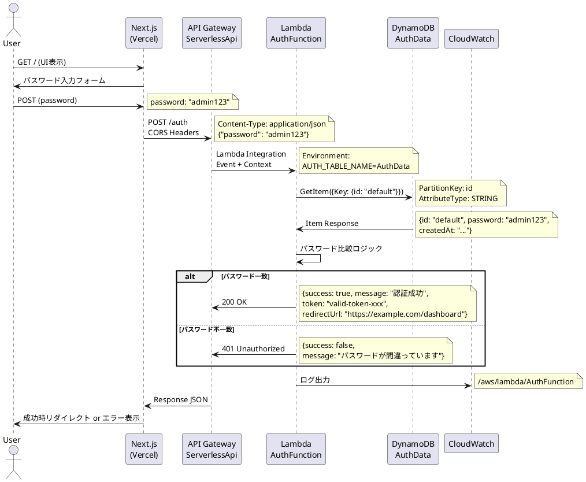
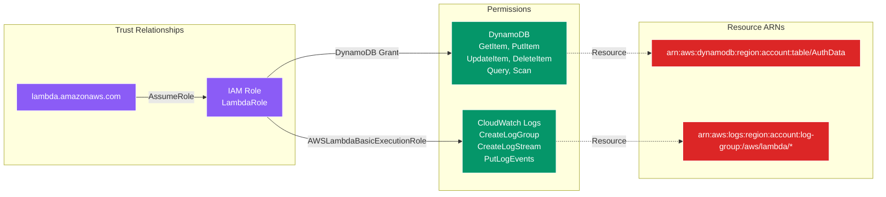
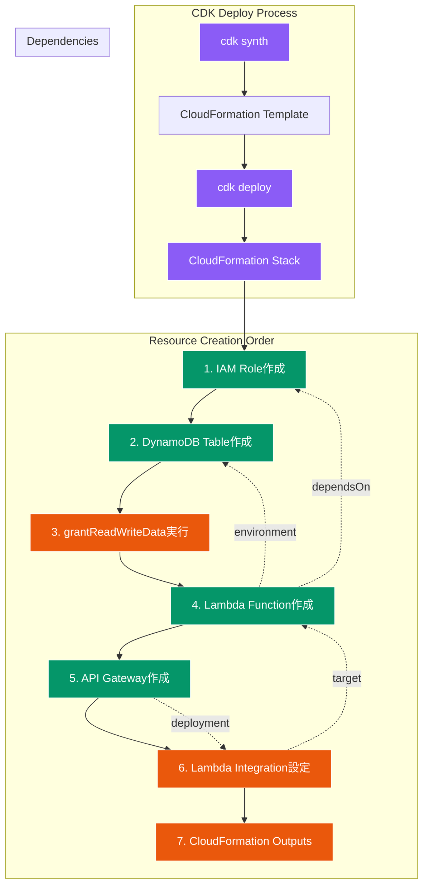
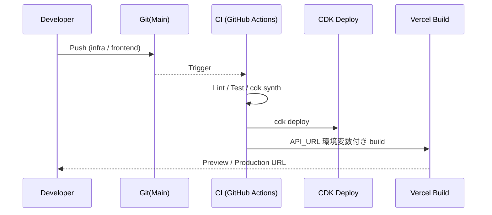

# システムアーキテクチャ概要

本プロジェクトは **Next.js フロントエンド** と **AWS Serverless バックエンド (API Gateway + Lambda + DynamoDB)** によりシンプルなパスワード認証 API を提供します。将来の拡張を前提に、認証強化・監視・セキュリティ境界を設計しやすいモジュール構成を採用します。

## 1. 実際のAWSリソース構成 (CDKベース)



## 2. CDKスタック詳細マッピング

| CDKリソース | AWS論理名 | 物理名(推定) | 設定値 |
|-------------|-----------|-------------|--------|
| `CdkInfrastructureStack` | CloudFormation Stack | CdkInfrastructureStack | - |
| `AuthTable` | DynamoDB Table | AuthData | PartitionKey: id (STRING) |
| `LambdaRole` | IAM Role | CdkInfrastructureStack-LambdaRole-xxx | AWSLambdaBasicExecutionRole |
| `AuthFunction` | Lambda Function | CdkInfrastructureStack-AuthFunction-xxx | Node.js 20.x, 環境変数: AUTH_TABLE_NAME |
| `ServerlessApi` | API Gateway | Serverless Auth API | CORS: ALL_ORIGINS, ALL_METHODS |
| - | API Resource | /auth | POST method only |
| - | CloudFormation Output | ApiGatewayUrl | https://xxxxx.execute-api.region.amazonaws.com/prod |

## 2. 詳細リクエストフロー (CDK構成反映)



## 3. AWS IAMセキュリティ境界



## 4. CDK Outputs と運用コマンド

### CloudFormation Outputs (CDKで自動出力)

```bash
# デプロイ後に確認可能な出力値
aws cloudformation describe-stacks \
  --stack-name CdkInfrastructureStack \
  --query 'Stacks[0].Outputs'

# 期待される出力:
# - ApiGatewayUrl: https://xxxxx.execute-api.ap-northeast-1.amazonaws.com/prod/
# - AuthTableName: AuthData
```

### リソース確認コマンド

```bash
# DynamoDB テーブル確認
aws dynamodb describe-table --table-name AuthData

# Lambda 関数確認  
aws lambda get-function --function-name CdkInfrastructureStack-AuthFunction-xxx

# API Gateway 確認
aws apigateway get-rest-apis --query 'items[?name==`Serverless Auth API`]'

# CloudWatch ロググループ確認
aws logs describe-log-groups --log-group-name-prefix "/aws/lambda/"
```

## 5. 物理 / 論理リソース一覧 (更新)

| 層 | サービス | 目的 | 拡張案 |
|----|----------|------|--------|
| フロント | Vercel / CloudFront | 静的配信 / SSR | WAF / Edge Functions |
| 認証UI | Next.js (App Router) | 入力フォーム | next-auth / Cognito 統合 |
| API | API Gateway REST | エンドポイント `/auth` | HTTP API への移行でコスト最適化 |
| 関数 | AWS Lambda | 認証ロジック | Lambda@Edge / Step Functions 連携 |
| データ | DynamoDB (AuthData) | パスワード保管 | KMS カスタムキー / Versioning |
| 設定 | SSM Parameter Store(予定) | 可変設定管理 | Secrets Manager 併用 |
| 監視 | CloudWatch Logs | ログ集約 | メトリクス + Alarms + Dashboards |
| CI/CD | GitHub Actions (想定) | 自動デプロイ | OPA / Security Scan |

## 6. セキュリティ設計（CDK実装ベース）

| セキュリティ項目 | CDK実装状況 | 推奨改善 |
|------------------|-------------|----------|
| IAM最小権限 | ✅ LambdaRole + grantReadWriteData | DynamoDB細かい Action 制限 |
| CORS設定 | ✅ ALL_ORIGINS, ALL_METHODS | 本番では Origin 限定 |
| 暗号化 | ⚠️ DynamoDB default encryption | Customer Managed Key (CMK) |
| ログ保護 | ⚠️ 平文ログ想定 | 入力値マスキング実装 |
| API認証 | ❌ 認証なし | Cognito Authorizer / JWT |
| ネットワーク | ❌ Public Lambda | VPC配置 + NAT Gateway |
| RemovalPolicy | ⚠️ DESTROY (開発用) | 本番では RETAIN |

### CDK で追加推奨設定

```typescript
// Lambda 関数のセキュリティ強化
const authFunction = new lambda.Function(this, 'AuthFunction', {
  // 既存設定...
  deadLetterQueue: dlq,  // DLQ追加
  reservedConcurrentExecutions: 10,  // 同時実行制限
  timeout: cdk.Duration.seconds(30),  // タイムアウト設定
  memorySize: 256,  // メモリ最適化
});

// DynamoDB暗号化強化
const authTable = new dynamodb.Table(this, 'AuthTable', {
  // 既存設定...
  encryption: dynamodb.TableEncryption.CUSTOMER_MANAGED,
  pointInTimeRecovery: true,  // PITR有効
});

// API Gateway セキュリティ
const api = new apigateway.RestApi(this, 'ServerlessApi', {
  // 既存設定...
  defaultCorsPreflightOptions: {
    allowOrigins: ['https://yourdomain.com'],  // Origin制限
    allowMethods: ['POST'],  // Method制限
  },
  deployOptions: {
    throttle: {
      rateLimit: 100,
      burstLimit: 200
    },
    loggingLevel: apigateway.MethodLoggingLevel.INFO,
  }
});
```

## 7. CDKデプロイフロー & リソース依存関係



### CDK Construct 依存関係詳細

| Construct | 依存先 | 理由 |
|-----------|--------|------|
| `AuthFunction` | `LambdaRole` | IAM Role for execution |
| `AuthFunction` | `AuthTable` | Environment variable `AUTH_TABLE_NAME` |
| `LambdaIntegration` | `AuthFunction` | Lambda function target |
| `authResource.addMethod` | `LambdaIntegration` | API method integration |
| `CfnOutput` | `api`, `authTable` | Output値参照 |

## 8. デプロイパイプライン概要 (CDK統合)



## 6. データモデル (AuthData)

```json
{
  "id": "default",
  "password": "admin123",
  "createdAt": "2024-01-01T00:00:00.000Z"
}
```
将来: `version`, `passwordHash`, `updatedAt`, `failedAttempts` などを追加。

## 7. 拡張ロードマップ

1. パスワードハッシュ化 (bcrypt) + 秘密キー管理 (SSM)
2. Cognito or 自前 JWT issuing Lambda 追加
3. エラーレスポンス標準化 (problem+json)
4. Observability: 構造化ログ + メトリクストレーシング (Powertools)
5. WAF レート制限 / Bot Control
6. IaC: 複数ステージ (dev/stg/prod) スタック分離
7. DynamoDB PITR / Terraform 連携検討（必要なら）

## 8. リスクと対策早見

| リスク | 影響 | 初期対策 |
|--------|------|----------|
| 平文パスワード漏洩 | 認証破綻 | 早期ハッシュ化実装 |
| ログに機密混入 | 情報漏えい | 入力値マスキング |
| 単一パスワード | 不正アクセス | 多要素 / ユーザプール導入 |
| 無制限試行 | ブルートフォース | 簡易レート制限 + WAF |
| 権限過大 | 横展開リスク | IAMポリシー最小化 |

## 9. 図ファイル運用

### Draw.io 構成図

- **超シンプル概要**: [`overview-simple.drawio`](./overview-simple.drawio)
  - 最も分かりやすい全体像（非技術者向け）
  - 4つの主要コンポーネントのみ
  - 大きなアイコンと明確なフロー

- **シンプル詳細**: [`simple-architecture.drawio`](./simple-architecture.drawio) 
  - 重要な情報に絞った構成図
  - 処理ステップとキー設定を表示
  - 絵文字アイコンで視覚的に分かりやすく

- **メインアーキテクチャ**: [`cdk-aws-architecture.drawio`](./cdk-aws-architecture.drawio)
  - CDK実装ベースの詳細AWS構成図
  - 実際のリソース名、IAM権限、データフロー
  - CloudFormation Outputs と操作コマンド

- **セキュリティ&デプロイ**: [`cdk-security-deploy.drawio`](./cdk-security-deploy.drawio)
  - CDKデプロイフロー & リソース作成順序
  - IAMセキュリティ境界と権限マッピング
  - 現在のセキュリティ課題と改善提案
  - 環境変数の流れ (CDK → Lambda → Frontend)

- **既存図**: `password_aws_architecture.drawio`
  - 高レベル概要図（継続利用）### 利用方法

1. **Draw.io デスクトップ** または **https://app.diagrams.net** で開く
2. 本 Markdown 内 Mermaid/PlantUML はレビュー・概要把握用
3. CI で `mmdc` / `plantuml` による PNG 化も検討可能

### 更新ルール

- CDKスタック変更時は `cdk-aws-architecture.drawio` を更新
- セキュリティ改善実装時は `cdk-security-deploy.drawio` のステータス更新
- 新機能追加時は新しいDraw.io図を作成し、本 README にリンク追加

## 10. 参照

- ルート README: 高レベル説明
- `cdk-infrastructure/lib/cdk-infrastructure-stack.ts`: リソース定義
- `cdk-infrastructure/lambda/auth.js`: 認証ロジック

---
更新日: 2025-08-11
